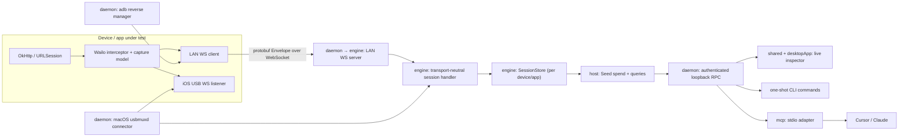

# Architecture

## Goal

Capture HTTP(S) traffic from *inside* a mobile app (no system proxy, no cert install) and inspect
it live on the desktop, with the same capture core reusable by headless automation and AI tooling.

## The two firewalls

Wailo is deliberately organized around two stable boundaries so the roadmap (automation, MCP, iOS)
does not require rewrites:

1. **Wire protocol (`protocol`)** - the protobuf schema is the single contract between device and
   desktop. Generated by Wire into Kotlin and Swift. This prevents model drift across
   languages and keeps serialization the same everywhere.
2. **Headless engine (`engine`)** - owns the transport server, a multi-session capture store, and a
   query/command API.
3. **Local daemon (`daemon`)** - is the single process owner of `engine`, adb, usbmuxd, pairing keys,
   rules, and holds. Studio, CLI, and MCP are clients of its authenticated loopback API (ADR-0058).

## Data flow

## Transport

- Protobuf `Envelope`s use one binary WebSocket message each. On LAN the device is the client and the
  desktop is the server (default port 8899, bound on every interface). The LAN port is changeable at
  runtime from Settings and persists across restarts; the engine rebinds in place without losing captured
  traffic or rule snapshots (ADR-0036).
- Android on the cable: forwarded over `adb reverse` per device, installed by the daemon rather than by hand.
  It watches the adb server's `host:track-devices` stream — falling back to an `adb devices -l` poll, which
  is also what starts a server to track (ADR-0052) — and runs `adb -s <serial> reverse tcp:8899 tcp:8899`
  for each ready one, re-forwarding them when the capture port moves (ADR-0050). Unlike usbmux this owns no
  connection — a reverse mapping only installs a route, and the device stays the client on the LAN server.
- iOS Simulator: shares the Mac's network stack, so `localhost:8899` reaches the LAN server directly.
- iOS physical device on macOS: the daemon monitors Apple's built-in `/var/run/usbmuxd` and connects to the
  SDK's device-local WebSocket listener on port 8900. This reverses only who opens the socket: the
  device still sends `Hello` and captures, and the engine still sends control snapshots and decisions.
  USB is preferred while connected; the existing LAN client resumes on unplug (ADR-0037). Both ends
  default to 8900 and both can change it — usbmux forwards to a port without advertising one, so the
  numbers are matched by hand in Settings and the on-device panel, never negotiated.
- USB recovery is two-sided: the iOS listener re-binds after iOS defuncts it during suspension (and on
  foreground), and the daemon polls `ListDevices` alongside the usbmuxd event stream, so a sleep/wake does
  not need a re-plug or an app restart.
- iOS physical device without USB: finds the LAN server over Bonjour (ADR-0035). This path still needs
  Local Network consent, Bonjour plist declarations, and ATS permission for plaintext `ws://`.
- Android over Wi-Fi: same handshake, same resolution order (ADR-0048). Discovery is `NsdManager`, the
  system's own mDNS client, so there is no third-party library and no `MulticastLock` — resolution happens
  in a system daemon, outside the app's process.
- Wi-Fi authentication is identity-first (ADR-0060): the device sends only a nonce and ephemeral key,
  Studio signs its identity and policy, and only then does the device reveal a random alias scoped to
  that Studio. An IP/hostname is only a route. A discovered or remembered target may carry an expected
  Studio fingerprint, while a manually edited address deliberately has none; a different signed identity
  at a saved target always waits for confirmation.
- Forget removes the device's per-Studio alias/key and, when that relationship is live, requests removal
  of the old alias over the sealed session. Offline revocation may leave an inert row in Studio, but an
  explicit reconnect uses a fresh alias and cannot collide with it. Discovery never enrolls a new alias.
- Discovery: the desktop advertises `_wailo._tcp` on its LAN address (JmDNS, best-effort — a failure
  never blocks the server); `sdk-ios` browses with `NWBrowser` and `sdk-android` with `NsdManager`. iOS
  host apps must declare `NSLocalNetworkUsageDescription` + `NSBonjourServices`, and an ATS exception for
  plaintext `ws://` to an IP literal; Android needs no manifest entry for either.
- Host resolution on both platforms, highest first: the `host` passed to `Wailo.start` /
  `Wailo.webSocketSink`, then the persisted override (iOS also takes a `-WailoHost` launch argument), then
  discovery — restricted to desktops this device already holds a key for — then `localhost`, which is
  where `adb reverse` and the Simulator put it. Every input is runtime-mutable (`Wailo.setHost`, or the
  on-device panel), so changing desktops never needs a rebuild. Forget suppresses this automatic
  resolution until a later explicit Connect action.
- Multiple devices/apps each have their own engine session. Studio connects to every USB-attached iOS
  device exposing the configured USB port; `Hello` identifies the app after the tunnel opens.
- Deferred: Windows/Linux iOS USB support.

## Multi-session model

Each connection is a `Session` (device + app identity from `Hello`). The `engine` keeps sessions and
per-session flows, plus a merged view. The desktop groups by session in a sidebar.

Captured exchanges are held in the daemon's memory only, so the engine keeps a bounded window of the most recent ones
(10,000 by default) and drops the oldest past it. The cap is changeable at runtime from Settings and
persists across restarts; lowering it trims what is already held, since the reason to lower it is memory
that is already spent.

## Studio surfaces

The desktop is one main window — a live traffic list over a detail panel — plus a single docked tool
panel on the right, chosen from an icon rail. At most one panel is open at a time, and they all share one
persisted width (ADR-0021). The panels are:

| Panel | What it does | Where its state lives |
|---|---|---|
| Capture Filter | Allow/block hosts, gated at the device (ADR-0029) | pushed to devices |
| Map Local | Answer matching requests with an authored response (ADR-0019) | pushed as match metadata; bodies read on the desktop, per request |
| Breakpoints | Pause matching requests/responses for live editing (ADR-0027) | pushed to devices |
| Seed | Canned responses that answer paused exchanges, in order (ADR-0041) | desktop only — never pushed |
| Devices | Connected devices, USB/LAN, and Wi-Fi trust (ADR-0039/0040) | host |
| Settings | Ports, retention, theme, text scale | host, persisted |

Held exchanges are edited in a second top-level window, not a modal, so traffic stays browsable beside
it (ADR-0034). That window is user-owned: it opens from the Breakpoints panel or when a hold needs a
human, and closes only when the user closes it (ADR-0041). Its left column lists the holds waiting over
the armed seeds, and one pane on the right shows whichever is selected — a hold to edit, a seed to read.
An arriving hold raises the window only when it is buried, and takes the pane only when the user isn't
already working on another hold (ADR-0043).

Every panel is stateless over its inputs. `shared` renders a layout and hands back a whole new one for
any change; `desktopApp` owns UI persistence and file IO, then sends state changes through the daemon client — which keeps
`shared` portable and free of `java.*` (ADR-0013). Map Local, Breakpoints, and Seed share one grouped rule
list (ADR-0026/0028), and each has an independent feature master that makes it inert without erasing what's
configured (ADR-0030). Only Map Local and Seed are drag-orderable, because only they resolve by first
match; every matching breakpoint rule fires, so ordering them would decide nothing (ADR-0042).

All three rule panels are also reachable from a captured row's right-click, which opens the panel on an
editor pre-filled from that exchange rather than asking for the URL again. Map Local and Seed both carry
the observed headers and body bytes; only Seed also carries the observed status code, because a seed
replays the exchange while a mapping authors a new one (ADR-0045).

Matching normally runs on the device — the desktop only ever pushes patterns. Seed is the exception: it
resolves holds locally, so it carries a desktop-side copy of the device's wildcard scheme, kept
byte-identical on purpose (ADR-0041).

## Headless surfaces

The `daemon` owns one `HeadlessHost`, the capture port, pairing Keychain, adb reverse mappings, and
usbmuxd connections. Any frontend starts it on demand if absent, then reads `~/.wailo/daemon.json` — the
owner-only handshake carrying the OS-chosen control port, the control-protocol version, and the per-run
token — and sees the same exchanges, devices, rules, filters, and holds. An exclusive lock on
`~/.wailo/daemon.lock` keeps exactly one daemon publishing that handshake (ADR-0059). It keeps running when
Studio closes or an MCP client's stdin reaches EOF; `wailo-cli stop` is the explicit shutdown path and
suppresses relaunch by clients that were already open. A fresh frontend starts it again. The authenticated
probe also versions the local control API, so a newer frontend can replace an incompatible older daemon
(ADR-0058).

`wailo-cli` sends one command directly to the daemon; `serve` remains a compatibility command that ensures
the daemon is running and returns. `wailo-mcp` remains a client-owned stdio process for Cursor/Claude, but
it is now only a protocol adapter over the daemon. Multiple MCP clients, CLI invocations, and Studio can
coexist without capture-port conflicts or split state. Map Local, breakpoint rules, and the capture filter
are daemon files under `~/.wailo/` so a restart still serves the same mocks and filter; Studio's grouped
layouts ride along as opaque strings. Captured traffic and paused holds remain in-memory session state
(ADR-0061). Map Local response bytes stay in the daemon's host registry and are fetched lazily through
`MapLocalBodyProvider`.

Two daemon settings govern that adapter rather than its lifecycle (ADR-0059). AI tool access, on by
default, is a gate: with it off every MCP tool including `status` is refused, while capture, Studio, and the
CLI carry on untouched. Secret redaction, also on by default, replaces credential and cookie headers,
sensitive query parameters, and secret-looking body fields with `<wailo:redacted>` on the way out of `mcp`
— never in `engine`, because Studio's inspector exists to show those values. Both live in the daemon so a
headless MCP session and an open Studio cannot disagree, and both are settable from Studio's Settings panel
and from `wailo-cli`.

## Module layout

See [AGENTS.md](AGENTS.md) for the module dependency rules. `sdk-*` is intentionally isolated from
`engine`/`host`/`daemon`/`shared`/`desktopApp`/`cli`/`mcp` because it ships inside third-party apps.

The device-side transport (`CaptureSink` + `WailoClient`) lives inside `sdk-android`. It used to be a
separate multiplatform `core` module kept thin so iOS could share it; once iOS became native Swift
(ADR-0010) that rationale disappeared, so `core` was folded into `sdk-android` (ADR-0011). `protocol`
and `shared` remain Kotlin Multiplatform (they back the shared desktop UI); nothing device-side is KMP
anymore.

## iOS strategy (resolved — ADR-0010)

The interceptor is platform-native (Android=OkHttp, iOS=URLProtocol/URLSession). `sdk-ios` is a
standalone **Swift** package, not a Kotlin/Native framework, so no Kotlin runtime ships inside host
apps (invariant #3). Cross-language consistency is kept by the wire contract, not shared code:

- `protocol/**/*.proto` is compiled to Swift by the Wire CLI (`./gradlew :protocol:generateSwiftProto`),
  committed under `sdk-ios/Sources/WailoProtocol/generated`.
- `WailoURLProtocol` captures URLSession traffic; it's installed via `URLProtocol.registerClass` plus a
  `URLSessionConfiguration` swizzle so third-party sessions are caught too (ADR-0009).
- A Swift `WailoClient` reimplements the buffer/reconnect loop over `URLSessionWebSocketTask`, emitting
  the same `Envelope` frames as the Kotlin client.

The transport logic is intentionally duplicated (Kotlin + Swift) to avoid Kotlin/Native; the protobuf
schema is not. See ADR-0006 (the original open question) and ADR-0010 (the resolution) in DECISIONS.md.
