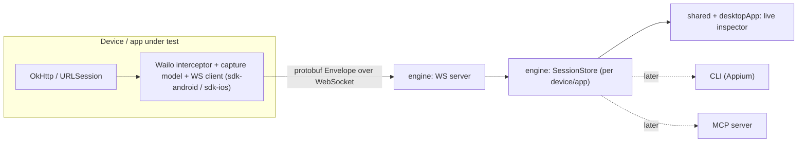

# Architecture

## Goal

Capture HTTP(S) traffic from *inside* a mobile app (no system proxy, no cert install) and inspect
it live on the desktop, with the same capture core reusable by headless automation and AI tooling.

## The two firewalls

Wailo is deliberately organized around two stable boundaries so the roadmap (automation, MCP, iOS)
does not require rewrites:

1. **Wire protocol (`protocol`)** - the protobuf schema is the single contract between device and
   desktop. Generated by Wire into Kotlin now, Swift later. This prevents model drift across
   languages and keeps serialization the same everywhere.
2. **Headless engine (`engine`)** - owns the transport server, a multi-session capture store, and a
   query/command API. Everything user-facing (desktop UI, CLI, MCP) is a thin frontend over it.

## Data flow

## Transport

- WebSocket. Device = client, desktop = server (default port 8899).
- Android: forwarded over `adb reverse` per device (`adb -s <serial> reverse tcp:8899 tcp:8899`).
- iOS: there is no `adb reverse`. The Simulator shares the Mac's network stack, so `localhost:8899`
  reaches the server directly; a physical device points `host` at the Mac's LAN IP. USB tunnelling
  (usbmux/PeerTalk) is deferred.
- Multiple devices/apps each open their own connection; the server distinguishes them by the `Hello`
  sent on connect.
- Deferred: mDNS/wifi discovery (for devices not adb-connected) and iOS USB tunnelling.

## Multi-session model

Each connection is a `Session` (device + app identity from `Hello`). The `engine` keeps sessions and
per-session flows, plus a merged view. The desktop groups by session in a sidebar.

## Module layout

See [AGENTS.md](AGENTS.md) for the module dependency rules. `sdk-*` is intentionally isolated from
`engine`/`shared`/`desktopApp` because it ships inside third-party apps.

The device-side transport (`CaptureSink` + `WailoClient`) lives inside `sdk-android`. It used to be a
separate multiplatform `core` module kept thin so iOS could share it; once iOS became native Swift
(ADR-0010) that rationale disappeared, so `core` was folded into `sdk-android` (ADR-0011). `protocol`
and `shared` remain Kotlin Multiplatform (they back the shared desktop UI); nothing device-side is KMP
anymore.

## iOS strategy (resolved — ADR-0010)

The interceptor is platform-native (Android=OkHttp, iOS=URLProtocol/URLSession). `sdk-ios` is a
standalone **Swift** package, not a Kotlin/Native framework, so no Kotlin runtime ships inside host
apps (invariant #3). Cross-language consistency is kept by the wire contract, not shared code:

- `protocol/**/*.proto` is compiled to Swift by the Wire CLI (`./gradlew :protocol:generateSwiftProto`),
  committed under `sdk-ios/Sources/WailoProtocol/generated`.
- `WailoURLProtocol` captures URLSession traffic; it's installed via `URLProtocol.registerClass` plus a
  `URLSessionConfiguration` swizzle so third-party sessions are caught too (ADR-0009).
- A Swift `WailoClient` reimplements the buffer/reconnect loop over `URLSessionWebSocketTask`, emitting
  the same `Envelope` frames as the Kotlin client.

The transport logic is intentionally duplicated (Kotlin + Swift) to avoid Kotlin/Native; the protobuf
schema is not. See ADR-0006 (the original open question) and ADR-0010 (the resolution) in DECISIONS.md.
