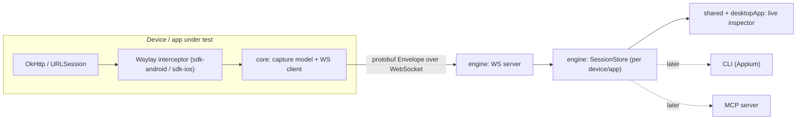

# Architecture

## Goal

Capture HTTP(S) traffic from *inside* a mobile app (no system proxy, no cert install) and inspect
it live on the desktop, with the same capture core reusable by headless automation and AI tooling.

## The two firewalls

Waylay is deliberately organized around two stable boundaries so the roadmap (automation, MCP, iOS)
does not require rewrites:

1. **Wire protocol (`protocol`)** - the protobuf schema is the single contract between device and
   desktop. Generated by Wire into Kotlin now, Swift later. This prevents model drift across
   languages and keeps serialization the same everywhere.
2. **Headless engine (`engine`)** - owns the transport server, a multi-session capture store, and a
   query/command API. Everything user-facing (desktop UI, CLI, MCP) is a thin frontend over it.

## Data flow

## Transport

- WebSocket. Device = client, desktop = server (default port 8899).
- Forwarded over `adb reverse` per device (`adb -s <serial> reverse tcp:8899 tcp:8899`). Multiple
  devices/apps each open their own connection; the server distinguishes them by the `Hello` sent on
  connect. Constraint: each device must be adb-reachable from the desktop machine.
- Deferred: mDNS/wifi discovery (for devices not adb-connected) and iOS transport (usbmux/wifi).

## Multi-session model

Each connection is a `Session` (device + app identity from `Hello`). The `engine` keeps sessions and
per-session flows, plus a merged view. The desktop groups by session in a sidebar.

## Module layout

See [AGENTS.md](AGENTS.md) for the module dependency rules. `sdk-*` is intentionally isolated from
`engine`/`shared`/`desktopApp` because it ships inside third-party apps.

## iOS strategy (open)

The interceptor is always platform-native (Android=OkHttp, iOS=URLProtocol/URLSession). Only `core`
is potentially shareable. Because protobuf carries the contract cross-language, iOS can later be
native Swift (if `core` stays thin) or a Kotlin/Native framework built from `core`. Decision deferred;
see DECISIONS.md.
